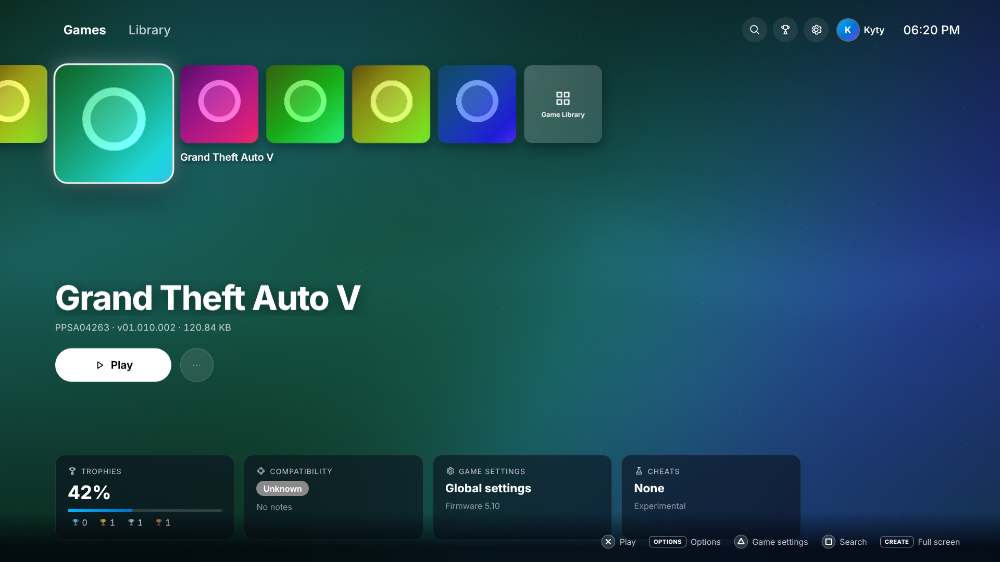

# KytyPS5 Dashboard

A console-style launcher for the [KytyPS5 emulator](https://github.com/At0mC3/KytyPS5-GTA-Linux)
that works with a controller, a keyboard or a mouse. It shares its settings file with the
emulator's Qt launcher, so either launcher can be used with the same games and configs.



## Install

Download the installer for your system from
[Releases](https://github.com/At0mC3/KytyPS5-Dashboard/releases) and install it anywhere; it
does not need to be in the emulator's folder.

| System | Installer | |
|---|---|---|
| Linux | `KytyPS5-Dashboard-<version>-linux-x86_64.AppImage` | Make it executable (`chmod +x`) and run it. |
| Windows | `KytyPS5-Dashboard-<version>-win-x64.exe` | Setup program; installs for the current user. |
| macOS | `KytyPS5-Dashboard-<version>-mac-x64.dmg` | Drag *KytyPS5 Dashboard* to Applications. |

On first start, the dashboard asks where KytyPS5 is: choose the folder that holds
`kyty_emulator` (`kyty_emulator.exe` on Windows; on macOS, the folder with `KytyPS5.app`). It
remembers the folder; change it in *Settings → Launcher → KytyPS5 location*.

The installers are not signed, so the system asks before running them the first time: on Windows,
*More info → Run anyway*; on macOS, *System Settings → Privacy & Security → Open Anyway*.

### Emulator version

The launcher gets GPU names, microphones, `.zar` archive contents and trophies from the emulator
(`kyty_emulator --query`). With an emulator that does not have `--query` yet, games still run,
but the GPU setting offers only "Auto" and archives show no art or trophies. To check, run
`kyty_emulator --query info`.

## Features

- **Dashboard**: a row of game tiles with the selected one enlarged, the game's art full screen
  behind it, a Play button, an options menu, and cards for trophies, compatibility, game settings
  and cheats. A grid **Game Library** with sorting, and search.
- **GPU rendering**: Chromium draws the UI on the GPU, and a WebGL 2 shader draws the background:
  the game art with a slow drift, cross-fades between games, moving light bands and a blur
  behind menus. Without WebGL 2, a CSS version is used. Animations change only `transform` and
  `opacity`, so the compositor runs them.
- **Full screen**: F11, the Create (View) button, *Settings → Launcher → Full screen*, or
  `--fullscreen` on the command line. The choice is remembered.
- **Every Qt launcher setting**: user profile, graphics and display, audio, notifications,
  compatibility, debugging and logs, controller (lightbar color with live preview, vibration,
  speaker volume), keyboard and mouse input mapping, game folders, and game config import/export.
  Per-game settings work like in the Qt launcher: saving creates a full copy of the settings.
- **Also**: trophies (per game and overview), cheats (remote collection and local selection),
  compatibility status (editable with `--local`), remove save data, open game folder, the GTA V
  recommended-settings prompt, and update checks in official emulator builds.
- **Emulator log**: the emulator runs without a terminal window; its output appears in the
  log console with colors.

## Controls

| Action | DualSense | Xbox | Keyboard |
|---|---|---|---|
| Move | D-pad, left stick | D-pad, left stick | Arrow keys |
| Select | Cross | A | Enter |
| Back | Circle | B | Esc, Backspace |
| Options (game menu, Save in settings) | Options | Menu | O |
| Search; delete on the keyboard | Square | X | S |
| Game settings; space on the keyboard | Triangle | Y | I |
| Previous / next tab or category | L1 / R1 | LB / RB | Q / E, Shift+Tab / Tab |
| Page up / down | L2 / R2 | LT / RT | Page Up / Page Down |
| Full screen | Create | View | F11 |
| Home | PS | Guide | Home |

Cross and Circle can be swapped in *Settings → Launcher*. Text fields open an on-screen
keyboard, and game folders can be added with a controller-friendly folder browser. The mouse
works everywhere too.

If the controller is not detected (some Bluetooth setups), set *Settings → Launcher →
Controller input* to *Emulator (SDL)*: the launcher then reads the controller through
`kyty_emulator --query controller`.

## Settings file

The launcher reads and writes the Qt launcher's `Kyty.ini` (QSettings INI format), in the same
places: `./Kyty.ini` when it exists, else `Kyty.ini` next to the emulator, else
`~/.config/Kyty/Kyty.ini` on Linux, `%ProgramData%\Kyty\Kyty.ini` on Windows, or Qt's system
settings path on macOS. It keeps keys it does not use, such as the Qt launcher's window
geometry, and stores its own preferences in an `[ElectronLauncher]` section. Avoid saving
settings in both launchers at the same time.

## Command line

| Option | Effect |
|---|---|
| `--fullscreen` | Start in full screen. |
| `--emulator=<path>` | Use this `kyty_emulator` for this run instead of the chosen KytyPS5 folder (also `KYTY_EMULATOR`). |
| `--local` | Read and edit the compatibility list in `./compatibility_db.json`. |
| `--self-test` | Print what the launcher found (emulator, devices, settings file, games) as JSON and exit. |

## How it talks to the emulator

The launcher runs `kyty_emulator --query info|archives|trophies|controller` (see
`src/query/launcherQuery.h` in the emulator repository). Each query prints one
`KYTY_QUERY_RESULT <json>` line; the controller helper keeps running and prints `KYTY_CTRL`
lines. The GPU list comes from the emulator, so it is in the order `--gpu <index>` uses.

Games start with the same arguments, in the same order, as from the Qt launcher.

## Development

Needs Node.js 22.12 or later (or `nix-shell`).

```sh
npm ci
npm run dev          # Start with hot reload; set KYTY_EMULATOR to a built kyty_emulator
npm run typecheck
npm test             # Unit tests (Vitest)
npm run build
xvfb-run -a npx playwright test   # End-to-end tests with a fake emulator (Linux)
```

End-to-end tests start the built app (`npm run build` first) with fixture games and
`test/fake-emulator/kyty_emulator`, drive it with a simulated controller, and save screenshots
to `test-results/screenshots`. Useful variables: `KYTY_E2E_SWIFTSHADER=1` to test the WebGL
background on machines without a GPU, `KYTY_E2E_SIZE=1080` for 1920x1080 screenshots, and
`KYTY_REAL_EMULATOR=<path>` to also test against a built emulator.

## Packaging

```sh
npm run package      # The installer for this system, in dist/
```

This builds the AppImage on Linux, the setup program on Windows and the disk image on macOS.
The AppImage's start script runs the app with `--no-sandbox` where Chromium's sandbox cannot
work (no unprivileged user namespaces, such as Ubuntu 24.04's AppArmor setting).

### Releases

CI builds, tests and packages the dashboard on Linux, Windows and macOS for every push and pull
request. Pushing a `v*` tag (matching `version` in `package.json`) publishes the three
installers as a GitHub release.

## Code layout

| Folder | Contents |
|---|---|
| `src/main` | Electron main process: `Kyty.ini` (`settings/`), game scanning (`library/`), launching and `--query` (`emulator/`), cheats, compatibility, updates, the `kyty://` protocol and IPC. |
| `src/preload` | The `window.kyty` API bridge. |
| `src/shared` | Settings model, input mapping and IPC types used by both sides. |
| `src/renderer` | The UI (React): screens, controller input and focus (`input/`, `focus/`), the WebGL background (`gfx/`), styles. |
| `test` | Fixtures, the fake emulator and Playwright tests. |

Much of `src/main` is a port of the emulator's Qt launcher; paths such as
`src/launcher/src/mainDialog.cpp` in comments refer to the emulator repository.

## Not verified on real hardware yet

These need a person with the hardware:

- The GPU list order on a computer with several GPUs.
- DualSense over USB and Bluetooth: navigation and the lightbar preview.
- Controller input in the launcher on Windows over Bluetooth after playing a game.
- The settings file location and permissions on macOS.
- The AppImage on Ubuntu 24.04 (the sandbox fallback), and the Windows and macOS installers on
  real machines.

## License

GPL-2.0, like the emulator it was ported from; see [LICENSE](LICENSE). The bundled Inter font
is under the SIL Open Font License ([LICENSES/Inter-OFL.txt](LICENSES/Inter-OFL.txt)).
